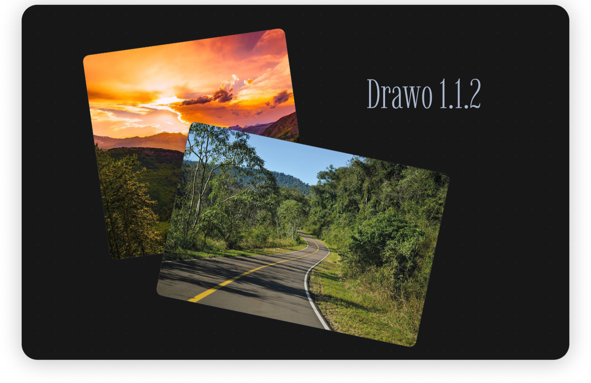
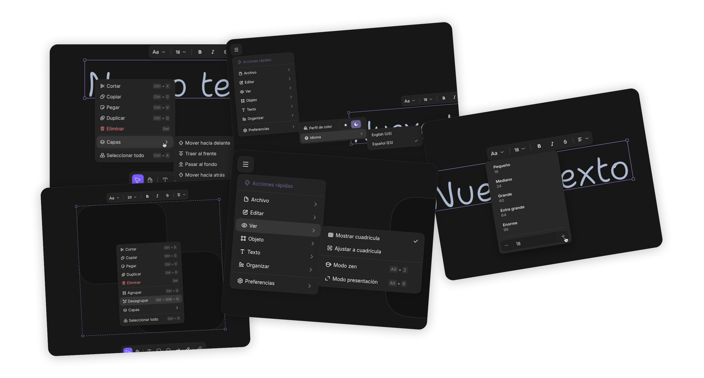
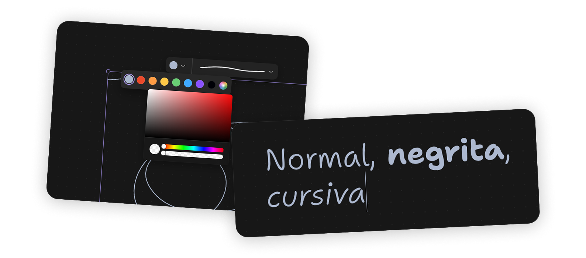
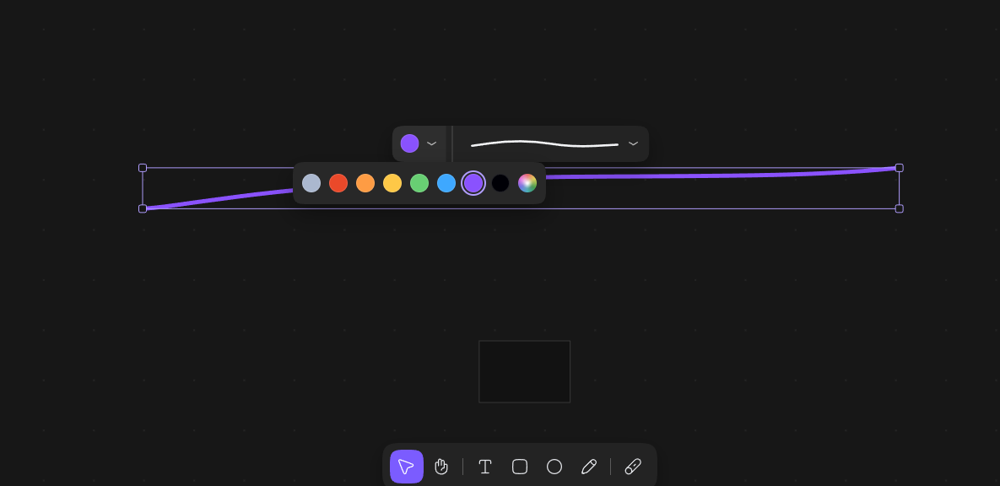

# [1.1.3] - 2026-03-29

## ✨ **Added**
- **Text color controls in text toolbar**
  Added full text color control to the selection text toolbar (including custom color picker + HEX input), now available both for standalone text elements and text content inside shapes while editing.

## 🔄 **Changed**
- **Shape stroke palette now matches fill palette**
  Shape border color options now use the same palette as fill colors for a more consistent editing workflow.
- **Drawo project export privacy cleanup**
  `.drawo` exports no longer serialize music state. Music settings continue to persist locally in the browser.

## 🐛 **Fixed**
- **Dark theme palette/render mismatch**
  Fixed inconsistent color inversion rules between UI palettes and canvas rendering:
  - `drawo-dark` now keeps the intended inversion behavior.
  - Other dark schemes (for example Catppuccin Dark) now render colors consistently between swatches and actual strokes/fills.
  - Exported images now follow the same color-resolution logic as the live canvas.
- **Custom color picker close behavior**
  Fixed an issue where custom color popovers could remain stuck open after clicking outside.
- **Custom color picker HEX field visibility**
  Restored visibility of the picker input area so HEX values can be typed/pasted directly.
- **Live text color updates while editing**
  Changing text color during in-place editing now updates immediately without needing to exit the editor.
- **Shape text color control placement**
  Removed duplicated shape text-color control from the outer shape toolbar; text color is now handled in the text editing toolbar where it belongs.
- **Minimum zoom clamp stability**
  Added a valid minimum zoom floor to prevent extreme negative/near-zero zoom corruption (`Ctrl + -` spam edge case).
- **Drawo dark default text contrast**
  Updated Drawo dark default shape text color to a readable light value to avoid low-contrast dark-on-dark text.

# [1.1.2] - 2026-03-10

## ✨ **Added**
- **Image element**
  Images can now be added by dragging them onto the canvas or by clicking on the image tool, which opens a file picker.
- **Different background grid styles**
  You can now switch between dot and square grids.

## 🔄 **Changed**
- **Improoved color picker**
  We have recoded the entire color selector component, creating a single component to render every time it appears in Drawo, to which we have added some cool animations.

# [1.1.1] - 2026-03-10

## ✨ **Added**

### 🧭 New menus

#### Right-click menu
We have greatly improved the right-click menu with additional icons and an important new feature: **groups** of elements.  
Groups allow multiple elements to be dragged together and include the following shortcuts:

- `Ctrl + G` → Group elements  
- `Ctrl + Shift + G` → Ungroup elements  

Shortcut hints have also been added directly in the respective menus.

#### Drawo menu (formerly Settings)
The settings menu code has been completely rewritten.

Two new canvas view modes have been added:

- **Zen Mode** → Hides secondary UI elements and leaves only the essential tools.
- **Presentation Mode** → Hides the toolbar and allows you to freely move around the canvas.

Both modes can be toggled from the top menu or using their respective shortcuts.

### ✏️ Text improvements
You can now fully customize the **font size** of text elements using a numeric input field that allows precise font size values.

## 🐛 **Fixed**

- **Pen optimization bug**  
  The recently added pen tool had serious performance issues because thickness calculations were executed every frame. This has been partially improved. Further optimizations will continue in future updates.

- **Selection box rendering bug**  
  In recent versions, the selection box could appear offset from the actual stroke depending on the distance from the center of the canvas. This caused the stroke and the bounding box to appear separated.  
  This issue has now been fixed.

---

(some versions that were not published here)

---

# [1.0.3] - 2026-03-10

## ✨ **Added**
- 🗒️ RIGHT-CLICK MENU NOW AVAILABLE IN PRODUCTION
> It doesn't have many options, but it finally allows you to control layers by `z-index` (to place one element above or below another), and some utilities that require shortcuts can now be done from there (I'll fill in the menu as I go along).

---

# [1.0.2] - 2026-03-10

## ✨ **Added**
- 🪶 QUILL (BRUSH) NOW AVAILABLE IN PRODUCTION
> We have added a new brush to the draw object.
> 
> It is called "quill", and its functionality is exactly the same as the normal pencil that was already there, but with speed sensitivity. The slower you draw, the thicker it is, and the faster you draw, the thinner it is. We have implemented it to offer both the functionality of the Excalidraw brush (which looks like this) and the Figjam brush (which looks like the pencil we already had).

---

# [1.0.1] - 2026-03-10

## ✨ **Added**
- Added lines/arrows element 
> They include their respective properties (like making them round, with custom line caps)
- Officially made the project open-source

---

# [1.0.0 BETA] - 2026-03-01

## ✨ **Added**
- Music
- Timer
- Improoved settings menu
- Started adding marker stroke type
- Started refactorization of code
- Advanced text formats.

---

# [0.5.0] - 2026-02-23

## ✨ **Added**
- Added color picker library: now you can choose custom colors for “draw” type elements (lines)
- Added slate library: text elements now support different styles within them (italics and bold only) and you can edit these texts and add these styles with the shortcuts Ctrl + B and Ctrl + I. In addition, they now support multiple lines and if you are editing text you can close the editor with Ctrl + Enter (as well as by clicking outside the editor).

-> This version is not yet open source. Version 1.0 will be.

---

# [0.4.0] - 2026-02-22

## ✨ **Added**
- Figma/Excali-type shortcuts (v, h, 1, 2, 3)
- Added border-radius to rectangles.
- Added “draw” type elements with all their respective functionalities working correctly (rotation, multiple selection, resize).
- Added functionality to write inside rectangles/circles.
- If you press shift while rotating an element, you can rotate it in a straighter and simpler way.
- If you press shift while resizing one or more elements, the size will be changed while maintaining its aspect ratio.
- Added functionality to change the size of texts.
- Added basic functionality to add context menu (not yet added).
- Ability to change the thickness of the draw border.

## 🔄 **Changed**
- Elements are now created with a “tool” style where, instead of dragging the elements onto the canvas, you create a region for that element, as in Excali/Figma. This is to make it more intuitive and classic so you don't have to learn new mechanics.

## 🐛 **Fixed**
- Fixed problems with the shape of bars and islands in Firefox/Safari.

-> This version is not yet open source. Version 1.0 will be.

---

# [0.3.0] - 2026-02-21

## 🔄 **Changed**
- Improved toolbar
- Improved animations and experience
- Improved colors with dark mode
- Shape of bars and islands (such as toolbars, selection bars, etc.) modified to have a squircle shape in the border radius.

## ✨ **Added**
- Icons added
- Selection bar added to edit font in texts (more options and elements coming soon)
- Ellipse/circle element added
- Pan interaction mode added
- Ctrl + C, Ctrl + X, Ctrl + V added
- Ctrl + Z / Ctrl + Y corrected
- Placeholder when there are no elements added

-> This version is not yet open source. Version 1.0 will be.

---

# [0.2.0] - 2026-02-20

## ✨ **Added**
- Added a way to rotate elements.
- Added dark mode.
- Added custom SVG cursors that change as needed on the canvas.
- Added functionality to select more than one element at a time.
> You can try it by selecting an element, then pressing Shift and selecting another element, or dragging the cursor to create a rectangular selection.
- Added functionality to delete elements with the “Delete” key.
- Added functionality to duplicate elements by pressing “Alt” and dragging an existing element.
- Added “Ctrl + A” to select all existing elements at once.

-> This version is not yet open source. Version 1.0 will be.
